<a name="readme-top"></a>

[![Contributors][contributors-shield]][contributors-url]
[![Forks][forks-shield]][forks-url]
[![Stargazers][stars-shield]][stars-url]
[![Issues][issues-shield]][issues-url]

<!-- PROJECT LOGO -->
<br />
<div align="center">
  <a href="https://github.com/Kathy331/resume-ai-agents">
    
  </a>

  <h3 align="center">InterviewPrep AI Agents</h3>

  <p align="center">
    A modular AI system that automates Interview preparation workflows using specialized agents.
    Streamlines Interviewer's background discovery, Company finding, roles insights, all contributing to a comprehensive prep guide, display on Streamlit dashboard and choice to edit and send to your own email via Inky bot service.
    <br />
    <a href="https://github.com/Kathy331/resume-ai-agents"><strong>Explore the docs »</strong></a>
    <br />
    <br />
    <a href="#">View Demo</a>
    ·
    <a href="https://github.com/Kathy331/resume-ai-agents/issues/new?labels=bug&template=bug-report---.md">Report Bugs</a>
    ·
    <a href="https://github.com/Kathy331/resume-ai-agents/issues/new?labels=enhancement&template=feature-request---.md">Request Features</a>
    <br />
    Contributions, issues, and feature requests are welcome!
    <br />
    Maintained by:<a href="https://github.com/Kathy331"> @Kathy331</a>

  </p>
</div>


<!-- TABLE OF CONTENTS -->
<details>
  <summary>Table of Contents</summary>
  <ol>
    <li>
      <a href="#about-the-project">About The Project</a>
      <ul>
        <li><a href="#built-with">Built With</a></li>
      </ul>
    </li>
    <li>
      <a href="#getting-started">Getting Started</a>
      <ul>
        <li><a href="#prerequisites">Prerequisites</a></li>
        <li><a href="#setup">Setup</a></li>
      </ul>
    </li>
    <li><a href="#usage">Usage</a></li>
    <li><a href="#system-architecture-diagram">System Architecture Diagram</a></li>
    <li><a href="#contact-and-developers">Contact and Developers</a></li>
    <li><a href="#acknowledgments">Acknowledgments</a></li>
  </ol>
</details>

<!-- ABOUT THE PROJECT -->
## About The Project
For more information please refer to the "docs" folder. Inside, there are flowcharts folders, agents folder, guidelines (standard for interview prep guide) folder, and pipeline folder, also include architecture markdown, etc. Which will all help you to understand the overall project architecture better.

<!-- Built With -->
### Built With

#### AI & Machine Learning
*  - GPT models for intelligent text processing and generation
*  - Named Entity Recognition for email parsing and resume analysis
*  - Machine learning utilities and text classification
*  - LLM application framework 

#### Frontend & Interface
*  - Interactive web dashboard and user interface
*  - Data visualizations and analytics charts

#### Backend & APIs
*  - Core backend language (3.10+)
*  - Interview data storage with deduplication
*  - Data manipulation and analysis
*  - Web search and company/interviewer research intelligence
*  - Email fetching and sending automation
*  - Secure authentication and authorization
*  - Data validation and settings management

#### Concepts & Techniques
*  - Testing framework for unit tests and integration tests
*  - Retrieval-Augmented Generation for context enrichment
*  - OpenAI API cache optimization and output file management


<p align="right">(<a href="#readme-top">back to top</a>)</p>

<!-- GETTING STARTED -->
## Getting Started

Follow these steps to get a local copy up and running:

### Prerequisites

Ensure you have Python 3.10+ 

### Setup

1. Clone the repo:
   ```bash
   git clone https://github.com/Kathy331/resume-ai-agents.git
   cd resume-ai-agents
   ```

2. Create and activate a virtual environment:
   ```bash
   python3 -m venv .venv.  #On Windows: python -m venv .venv
   source .venv/bin/activate #On Windows: .venv\Scripts\activate
   ```

3. Install Python dependencies:
   ```bash
   pip install -r requirements.txt
   ``` 
   make sure to also download spacy model before running workflow_runner.py
   ```bash
    python -m spacy download en_core_web_sm
   ``` 
4. Copy .env.example to .env and fill in your:
    - OpenAI API Key (create one here: https://platform.openai.com/api-keys)
    - Tavily API Key (create one here: https://www.tavily.com/)
    - Google API credentials JSON file (create one here: https://cloud.google.com/docs/authentication/getting-started) or contact any of the developers to get the secret file
   ```bash
    cp .env.example .env
   ``` 
5. Set up bot email credentials:
   - Follow the instructions in `setup_bot_email.py` to authenticate with Gmail API
   - Ensure you have the `google_oauth` folder with your credentials JSON file

6. Run the Streamlit app:
   ```bash
   streamlit run ui/testui/app.py
   ```

7. Optional: Use Docker for containerized deployment:
    Download Docker for Mac or Windows: https://www.docker.com/  
   ```bash
   docker compose up --build 
   ```
8. Testing:
    to run all test you could run: 
    ```bash
    pytest
    ```
    but please be careful of token limits, to run a single test, run: 
    ```bash
    pytest tests/test_agents/test_keyword_extractor.py
    ```
    there will be an `outputs` file generated for you to better see your test results 


<p align="right">(<a href="#readme-top">back to top</a>)</p>

<!-- USAGE -->
## Usage
Once the app is running, you can:
<!-- demo video with all features below: [link to demo video] ##TODO: add link to demo video -->
- **View the dashboard**: Access the Streamlit interface in your browser (usually at `http://localhost:8501`)
- **Set up your bot email**: Authenticate with Gmail to enable sending emails directly from the app
- **Generate prep guides**: Use the provided buttons to trigger different agents:
- **Monitor logs**: Check the console output for agent activity and debugging information
- **Send emails**: Use the Inky bot service to send personalized application emails directly from the app, you can send all the generated prep guide to your own email or pick a specific email address to send 
- **View results**: Check the generated prep guide on the dashboard, which includes company insights, role details, and personalized questions
- **Edit and save**: Modify the prep guide as needed and save it to your local machine or send it via email
- **Download files**: Download any generated files or reports for offline access


<p align="right">(<a href="#readme-top">back to top</a>)</p>

<!--FlowChart -->
## System Architecture Diagram

```mermaid
flowchart TB
    subgraph EmailPipeline["📧 Email Pipeline"]
        direction TB
        InterviewFolder["📁 INTERVIEW_FOLDER<br>• Configurable email source<br>• Individual email processing"]
        EmailClassifier["📬 Email Classifier Agent<br>• Interview vs Personal vs Other<br>• OpenAI GPT-4o-mini"]
        EntityExtractor["🎯 Entity Extractor Agent<br>• Company, Role, Interviewer<br>• Custom spaCy NER model"]
        KeywordExtractor["🏷️ Keyword Extractor Agent<br>• Company name extraction<br>• Safe filename generation"]
        MemoryCheck{"🧠 Memory Systems Check<br>• Interview Store lookup<br>• Duplicate prevention"}
    end

    subgraph DeepResearchPipeline["🔬 Deep Research Pipeline"]
        direction TB
        ResearchCoordinator["🤖 Research Coordinator<br>• Multi-agent orchestration<br>• Parallel API calls"]
        CompanyResearch["🏢 Company Research Agent<br>• Tavily API integration<br>• Culture & news analysis"]
        RoleResearch["💼 Role Research Agent<br>• Market trends analysis<br>• Skill requirements"]
        InterviewerResearch["👤 Interviewer Research Agent<br>• LinkedIn profile search<br>• Professional background"]
        QualityReflection["🤔 Research Quality Reflection<br>• Adequacy validation<br>• Additional research loops"]
    end

    subgraph PrepGuidePipeline["📚 Prep Guide Pipeline"]
        direction TB
        GuideGenerator["📝 Personalized Guide Generator<br>• OpenAI GPT-4o integration<br>• Research-driven content"]
        TechnicalPrep["⚡ Technical Prep Section<br>• Role-specific competencies<br>• Sample questions"]
        InterviewerInsights["👥 Interviewer Background Analysis<br>• Professional insights<br>• Connection points"]
        StrategicQuestions["❓ Strategic Questions Generator<br>• Personalized inquiries<br>• Research-backed"]
        CitationEngine["📄 Citation Engine<br>• Source references<br>• Research credibility"]
    end

    subgraph CacheManagement["💾 Cache Management Systems"]
        direction TB
        TavilyCache["🌐 Tavily Cache<br>• API response caching<br>• Query optimization<br>• cache/tavily/ directory"]
        OpenAICache["🤖 OpenAI Cache<br>• Response caching<br>• Cost optimization<br>• .openai_cache/ directory"]
        CacheManager["⚙️ Cache Manager CLI<br>• Status monitoring<br>• Cache clearing<br>• Optimization tools"]
    end

    subgraph MemorySystems["🧠 Memory Systems"]
        direction TB
        InterviewStore["📋 Interview Store<br>• SQLite database<br>• Deduplication logic<br>• Status tracking"]
        ResumeMemory["📄 Resume Memory<br>• User profile storage<br>• Skills & experience<br>• Context integration"]
        SharedMemory["🌉 Shared Memory Layer<br>• Cross-agent context<br>• State synchronization"]
    end

    subgraph WorkflowOrchestration["🎯 Workflow Orchestration"]
        direction TB
        MainWorkflow["🚀 Interview Prep Workflow<br>• Individual email processing<br>• Terminal feedback<br>• workflows/interview_prep_workflow.py"]
        WorkflowRunner["⚡ Workflow Runner<br>• Pipeline coordination<br>• Error handling<br>• workflows/workflow_runner.py"]
    end

    subgraph OutputManagement["📁 Output Management"]
        direction TB
        FileOutput["📝 Individual Company Files<br>• outputs/fullworkflow/<br>• [company_name].txt format<br>• Complete prep guides"]
        TerminalFeedback["💬 Real-time Terminal Output<br>• Processing progress<br>• Classification results<br>• Research status"]
    end

    %% Main workflow connections
    MainWorkflow --> InterviewFolder
    InterviewFolder --> EmailClassifier
    EmailClassifier --> EntityExtractor
    EntityExtractor --> KeywordExtractor
    KeywordExtractor --> MemoryCheck
    
    %% Memory check branching
    MemoryCheck -->|"Already Processed"| TerminalFeedback
    MemoryCheck -->|"New Interview"| ResearchCoordinator
    
    %% Research pipeline flow
    ResearchCoordinator --> CompanyResearch
    ResearchCoordinator --> RoleResearch  
    ResearchCoordinator --> InterviewerResearch
    CompanyResearch --> QualityReflection
    RoleResearch --> QualityReflection
    InterviewerResearch --> QualityReflection
    
    %% Quality reflection branching
    QualityReflection -->|"Sufficient"| GuideGenerator
    QualityReflection -->|"Insufficient"| ResearchCoordinator
    
    %% Prep guide pipeline flow
    GuideGenerator --> TechnicalPrep
    GuideGenerator --> InterviewerInsights
    GuideGenerator --> StrategicQuestions
    TechnicalPrep --> CitationEngine
    InterviewerInsights --> CitationEngine
    StrategicQuestions --> CitationEngine
    CitationEngine --> FileOutput
    
    %% Cache integration
    CompanyResearch <--> TavilyCache
    RoleResearch <--> TavilyCache
    InterviewerResearch <--> TavilyCache
    GuideGenerator <--> OpenAICache
    TechnicalPrep <--> OpenAICache
    InterviewerInsights <--> OpenAICache
    StrategicQuestions <--> OpenAICache
    
    %% Memory systems integration
    MemoryCheck <--> InterviewStore
    EntityExtractor <--> ResumeMemory
    ResearchCoordinator <--> SharedMemory
    GuideGenerator <--> SharedMemory
    
    %% Cache management
    CacheManager --> TavilyCache
    CacheManager --> OpenAICache
    
    %% Workflow coordination
    WorkflowRunner --> MainWorkflow
    MainWorkflow --> TerminalFeedback
    FileOutput --> TerminalFeedback

    %% Non-interview email handling
    EmailClassifier -->|"Personal/Other"| TerminalFeedback

    %% Styling
    classDef emailStyle fill:#e3f2fd,stroke:#1976d2,stroke-width:2px,color:#000000
    classDef researchStyle fill:#f1f8e9,stroke:#558b2f,stroke-width:2px,color:#000000
    classDef prepStyle fill:#e8eaf6,stroke:#3f51b5,stroke-width:2px,color:#000000
    classDef cacheStyle fill:#fff3e0,stroke:#f57c00,stroke-width:2px,color:#000000
    classDef memoryStyle fill:#fce4ec,stroke:#c2185b,stroke-width:2px,color:#000000
    classDef workflowStyle fill:#e8f5e8,stroke:#2e7d32,stroke-width:3px,color:#000000
    classDef outputStyle fill:#f3e5f5,stroke:#7b1fa2,stroke-width:2px,color:#000000

    class InterviewFolder,EmailClassifier,EntityExtractor,KeywordExtractor,MemoryCheck emailStyle
    class ResearchCoordinator,CompanyResearch,RoleResearch,InterviewerResearch,QualityReflection researchStyle
    class GuideGenerator,TechnicalPrep,InterviewerInsights,StrategicQuestions,CitationEngine prepStyle
    class TavilyCache,OpenAICache,CacheManager cacheStyle
    class InterviewStore,ResumeMemory,SharedMemory memoryStyle
    class MainWorkflow,WorkflowRunner workflowStyle
    class FileOutput,TerminalFeedback outputStyle
```



---
### Key Features Highlighted in This Flowchart

#### **3-Pipeline Architecture**
- **Email Pipeline**: Classification, entity extraction, memory management
- **Deep Research Pipeline**: Multi-agent research with Tavily API integration
- **Prep Guide Pipeline**: Personalized guide generation with citations

#### **Cache Management Systems**
- **Tavily Cache**: Research query caching for cost optimization (`cache/tavily/`)
- **OpenAI Cache**: Response caching for guide generation (`.openai_cache/`)
- **Cache Manager CLI**: Centralized cache monitoring and management (`workflows/cache_manager.py`)

#### **Memory Systems**
- **Interview Store**: SQLite-based deduplication and status tracking
- **Shared Memory**: Cross-agent context synchronization

#### **API Integrations**
- **Tavily API**: Web search and company intelligence (`api/run_tavily.py`)
- **OpenAI API**: Guide generation and content creation (`shared/openai_cache.py`)

#### **Main Entry Points**
- **Interview Prep Workflow**: `workflows/interview_prep_workflow.py`
- **Cache Manager**: `workflows/cache_manager.py --status`
- **Workflow Runner**: `workflows/workflow_runner.py`

<p align="right">(<a href="#readme-top">back to top</a>)</p>

<!-- CONTACT -->
## Contact and Developers

Kathy Chen - [@Linkedin](https://www.linkedin.com/in/kathy-chen-b35b532a6/) - email: kathychen331@outlook.com

Grace Chen - [@Linkedin](https://www.linkedin.com/in/chen-p-grace/) - email: chenpgrace1@gmail.com

Julianna Bracamonte - [@Linkedin](https://www.linkedin.com/in/julianna-bracamonte-759644237/) - email: 


<p align="right">(<a href="#readme-top">back to top</a>)</p>

<!-- ACKNOWLEDGMENTS -->
## Acknowledgments
 
* [Dandilyonn SEEDS Program](https://www.dandilyonn.com/)
*  Streamlit for their amazing framework  
*  OpenAI for language models powering the agents  
*  Tavily for intelligent web search APIs 

<p align="right">(<a href="#readme-top">back to top</a>)</p>

<!-- MARKDOWN LINK & IMAGE DEFINITIONS -->
[contributors-shield]: https://img.shields.io/github/contributors/Kathy331/resume-ai-agents.svg?style=flat-square
[contributors-url]: https://github.com/Kathy331/resume-ai-agents/graphs/contributors
[forks-shield]: https://img.shields.io/github/forks/Kathy331/resume-ai-agents.svg?style=flat-square
[forks-url]: https://github.com/Kathy331/resume-ai-agents/network/members
[stars-shield]: https://img.shields.io/github/stars/Kathy331/resume-ai-agents.svg?style=flat-square
[stars-url]: https://github.com/Kathy331/resume-ai-agents/stargazers
[issues-shield]: https://img.shields.io/github/issues/Kathy331/resume-ai-agents.svg?style=flat-square
[issues-url]: https://github.com/Kathy331/resume-ai-agents/issues
