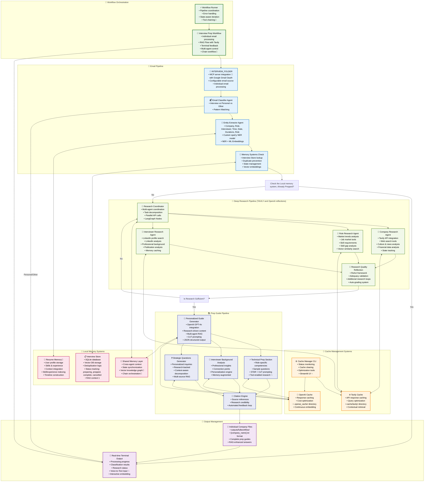

```mermaid
flowchart TB
 subgraph EmailPipeline["📧 Email Pipeline"]
    direction TB
        InterviewFolder["📁 INTERVIEW_FOLDER<br>• MCP server integration 🔴 with Google Gmail Oauth<br>• Configurable email source<br>• Individual email processing"]
        EmailClassifier["📬 Email Classifier Agent<br>• Interview vs Personal vs Other<br>• Pattern Matching<br>"]
        EntityExtractor["🎯 Entity Extractor Agent<br>• Company, Role, Interviewer, Time, Date, Durations, Role<br>• Custom spaCy NER model<br>• NER + ML Embeddings"]
        MemoryCheck["🧠 Memory Systems Check<br>• Interview Store lookup<br>• Duplicate prevention<br>• State management<br>• Vector embeddings"]
  end
 subgraph DeepResearchPipeline["🔬 Deep Research Pipeline (TAVILY and OpenAI reflections)"]
    direction TB
        ResearchCoordinator["🤖 Research Coordinator<br>• Multi-agent coordination<br>• Task decomposition<br>• Parallel API calls<br>• LangGraph Nodes"]
        CompanyResearch["🏢 Company Research Agent<br>• Tavily API integration<br>• Web search tools<br>• Culture &amp; news analysis<br>• Financial data analysis<br>• State tracking"]
        RoleResearch["💼 Role Research Agent<br>• Market trends analysis<br>• Job market tools<br>• Skill requirements<br>• Skill gap analysis<br>• Vector similarity search"]
        InterviewerResearch["👤 Interviewer Research Agent<br>• LinkedIn profile search<br>• LinkedIn analysis<br>• Professional background<br>• Publication analysis<br>• Memory caching"]
        QualityReflection["🤔 Research Quality Reflection<br>• ReAct framework<br>• Adequacy validation<br>• Additional research loops<br>• Auto-grading system"]
  end
 subgraph PrepGuidePipeline["📚 Prep Guide Pipeline"]
    direction TB
        GuideGenerator["📝 Personalized Guide Generator<br>• OpenAI GPT-4o integration<br>• Research-driven content<br>• Multi-agent RAG<br>• CoT prompting<br>• JSON structured output"]
        TechnicalPrep["⚡ Technical Prep Section<br>• Role-specific competencies<br>• Sample questions<br>• STAR + CoT prompting<br>• Tool-enabled research ✨"]
        InterviewerInsights["👥 Interviewer Background Analysis<br>• Professional insights<br>• Connection points<br>• Personalization engine<br>• Memory-augmented"]
        StrategicQuestions["❓ Strategic Questions Generator<br>• Personalized inquiries<br>• Research-backed<br>• Context-aware decomposition<br>• Multi-source RAG"]
        CitationEngine["📄 Citation Engine<br>• Source references<br>• Research credibility<br>• Automated feedback loop"]
  end
 subgraph CacheManagement["💾 Cache Management Systems"]
    direction TB
        TavilyCache["🌐 Tavily Cache<br>• API response caching<br>• Query optimization<br>• cache/tavily/ directory<br>• Contextual retrieval"]
        OpenAICache["🤖 OpenAI Cache<br>• Response caching<br>• Cost optimization<br>• .openai_cache/ directory<br>• Continuous embedding"]
        CacheManager["⚙️ Cache Manager CLI<br>• Status monitoring<br>• Cache clearing<br>• Optimization tools<br>• Streamlit UI ✨"]
  end
 subgraph MemorySystems["🧠 Local Memory Systems"]
    direction TB
        InterviewStore["📋 Interview Store<br>• SQLite database<br>• Vector DB storage<br>• Deduplication logic<br>• Status tracking: preparing, prepped, complete, cancelled<br>• RAG context 1"]
        ResumeMemory@{ label: "📄 Resume Memory<span style=\"color:\">🔴</span><br>• User profile storage<br>• Skills &amp; experience<br>• Context integration<br>• Skill/experience indexing<br>• Timeline construction" }
        SharedMemory@{ label: "🌉 Shared Memory Layer<br>• Cross-agent context<br>• State synchronization<br>• Vector knowledge graph<span style=\"color:\">🔴</span><br>• Chain orchestration<span style=\"color:\">🔴</span>" }
  end
 subgraph WorkflowOrchestration["🎯 Workflow Orchestration"]
    direction TB
        MainWorkflow["🚀 Interview Prep Workflow<br>• Individual email processing<br>• RAG Flow with Tavily <br>• Terminal feedback<br>• Multi-agent control<br>• Chain workflow🔴"]
        WorkflowRunner["⚡ Workflow Runner<br>• Pipeline coordination<br>• Error handling<br>• State-aware iteration<br>• Tool chaining🔴"]
  end
 subgraph OutputManagement["📁 Output Management"]
    direction TB
        FileOutput["📝 Individual Company Files<br>• outputs/fullworkflow/<br>• [company_name].txt format<br>• Complete prep guides<br>• RAG-enhanced answers"]
        TerminalFeedback["💬 Real-time Terminal Output<br>• Processing progress<br>• Classification results<br>• Research status<br>• Voice-to-Text input ✨<br>• Interactive embedding"]
  end
    MainWorkflow --> InterviewFolder & TerminalFeedback
    InterviewFolder --> EmailClassifier
    EmailClassifier --> EntityExtractor
    EntityExtractor --> MemoryCheck
    MemoryCheck --> AlreadyProcessed["Check the Local memory system, Already Prepped?"]
    AlreadyProcessed -- Yes --> TerminalFeedback
    AlreadyProcessed -- No --> ResearchCoordinator
    ResearchCoordinator --> CompanyResearch & RoleResearch & InterviewerResearch
    CompanyResearch --> QualityReflection
    RoleResearch --> QualityReflection
    InterviewerResearch --> QualityReflection
    QualityReflection --> ReflectionCheck["Is Research Sufficient?"]
    ReflectionCheck -- Yes --> GuideGenerator
    ReflectionCheck -- No --> ResearchCoordinator
    GuideGenerator --> TechnicalPrep & InterviewerInsights & StrategicQuestions
    TechnicalPrep --> CitationEngine
    InterviewerInsights --> CitationEngine
    StrategicQuestions --> CitationEngine
    CitationEngine --> FileOutput
    CompanyResearch <--> TavilyCache
    RoleResearch <--> TavilyCache
    InterviewerResearch <--> TavilyCache
    GuideGenerator <--> OpenAICache & SharedMemory
    TechnicalPrep <--> OpenAICache
    InterviewerInsights <--> OpenAICache
    StrategicQuestions <--> OpenAICache
    MemoryCheck <--> InterviewStore
    EntityExtractor <--> ResumeMemory
    ResearchCoordinator <--> SharedMemory
    CacheManager --> TavilyCache & OpenAICache
    WorkflowRunner --> MainWorkflow
    FileOutput --> TerminalFeedback
    EmailClassifier -- Personal/Other --> TerminalFeedback

    ResumeMemory@{ shape: rect}
    SharedMemory@{ shape: rect}
     InterviewFolder:::emailStyle
     EmailClassifier:::emailStyle
     EntityExtractor:::emailStyle
     MemoryCheck:::emailStyle
     ResearchCoordinator:::researchStyle
     CompanyResearch:::researchStyle
     RoleResearch:::researchStyle
     InterviewerResearch:::researchStyle
     QualityReflection:::researchStyle
     GuideGenerator:::prepStyle
     TechnicalPrep:::prepStyle
     InterviewerInsights:::prepStyle
     StrategicQuestions:::prepStyle
     CitationEngine:::prepStyle
     TavilyCache:::cacheStyle
     OpenAICache:::cacheStyle
     CacheManager:::cacheStyle
     InterviewStore:::memoryStyle
     ResumeMemory:::memoryStyle
     SharedMemory:::memoryStyle
     MainWorkflow:::workflowStyle
     WorkflowRunner:::workflowStyle
     FileOutput:::outputStyle
     TerminalFeedback:::outputStyle
    classDef emailStyle fill:#e3f2fd,stroke:#1976d2,stroke-width:2px,color:#000000
    classDef researchStyle fill:#f1f8e9,stroke:#558b2f,stroke-width:2px,color:#000000
    classDef prepStyle fill:#e8eaf6,stroke:#3f51b5,stroke-width:2px,color:#000000
    classDef cacheStyle fill:#fff3e0,stroke:#f57c00,stroke-width:2px,color:#000000
    classDef memoryStyle fill:#fce4ec,stroke:#c2185b,stroke-width:2px,color:#000000
    classDef workflowStyle fill:#e8f5e8,stroke:#2e7d32,stroke-width:3px,color:#000000
    classDef outputStyle fill:#f3e5f5,stroke:#7b1fa2,stroke-width:2px,color:#000000


```