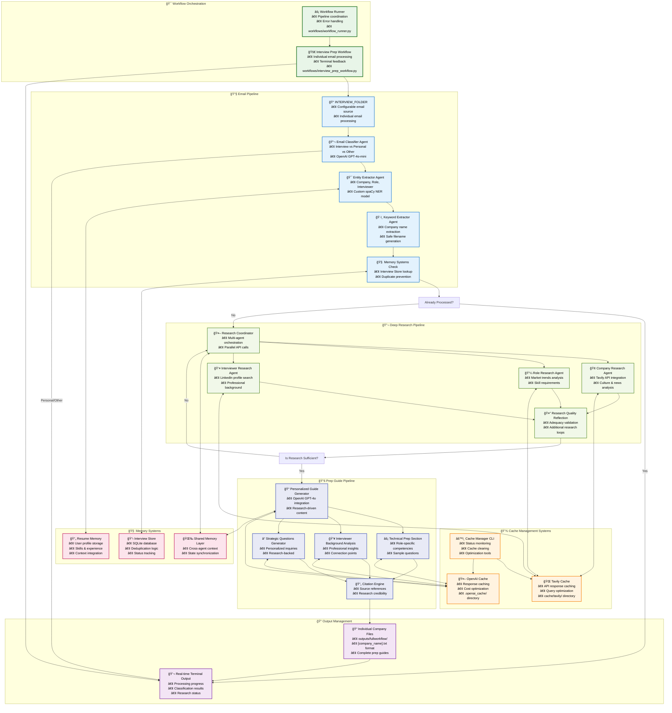

```mermaid
flowchart TB
    %% Email Pipeline
    subgraph EmailPipeline["📧 Email Pipeline"]
        direction TB
        InterviewFolder["📠INTERVIEW_FOLDER<br/>• Configurable email source<br/>• Individual email processing"]
        EmailClassifier["📬 Email Classifier Agent<br/>• Interview vs Personal vs Other<br/>• OpenAI GPT-4o-mini"]
        EntityExtractor["🯠Entity Extractor Agent<br/>• Company, Role, Interviewer<br/>• Custom spaCy NER model"]
        KeywordExtractor["ğŸ·ï¸ Keyword Extractor Agent<br/>• Company name extraction<br/>• Safe filename generation"]
        MemoryCheck["🧠 Memory Systems Check<br/>• Interview Store lookup<br/>• Duplicate prevention"]
    end

    %% Deep Research Pipeline
    subgraph DeepResearchPipeline["🔬 Deep Research Pipeline"]
        direction TB
        ResearchCoordinator["🤖 Research Coordinator<br/>• Multi-agent orchestration<br/>• Parallel API calls"]
        CompanyResearch["🢠Company Research Agent<br/>• Tavily API integration<br/>• Culture & news analysis"]
        RoleResearch["💼 Role Research Agent<br/>• Market trends analysis<br/>• Skill requirements"]
        InterviewerResearch["👤 Interviewer Research Agent<br/>• LinkedIn profile search<br/>• Professional background"]
        QualityReflection["🤔 Research Quality Reflection<br/>• Adequacy validation<br/>• Additional research loops"]
    end

    %% Prep Guide Pipeline
    subgraph PrepGuidePipeline["📚 Prep Guide Pipeline"]
        direction TB
        GuideGenerator["📠Personalized Guide Generator<br/>• OpenAI GPT-4o integration<br/>• Research-driven content"]
        TechnicalPrep["⚡ Technical Prep Section<br/>• Role-specific competencies<br/>• Sample questions"]
        InterviewerInsights["👥 Interviewer Background Analysis<br/>• Professional insights<br/>• Connection points"]
        StrategicQuestions["ⓠStrategic Questions Generator<br/>• Personalized inquiries<br/>• Research-backed"]
        CitationEngine["📄 Citation Engine<br/>• Source references<br/>• Research credibility"]
    end

    %% Cache Management
    subgraph CacheManagement["💾 Cache Management Systems"]
        direction TB
        TavilyCache["🌠Tavily Cache<br/>• API response caching<br/>• Query optimization<br/>• cache/tavily/ directory"]
        OpenAICache["🤖 OpenAI Cache<br/>• Response caching<br/>• Cost optimization<br/>• .openai_cache/ directory"]
        CacheManager["âš™ï¸ Cache Manager CLI<br/>• Status monitoring<br/>• Cache clearing<br/>• Optimization tools"]
    end

    %% Memory Systems
    subgraph MemorySystems["🧠 Memory Systems"]
        direction TB
        InterviewStore["📋 Interview Store<br/>• SQLite database<br/>• Deduplication logic<br/>• Status tracking"]
        ResumeMemory["📄 Resume Memory<br/>• User profile storage<br/>• Skills & experience<br/>• Context integration"]
        SharedMemory["🌉 Shared Memory Layer<br/>• Cross-agent context<br/>• State synchronization"]
    end

    %% Workflow Orchestration
    subgraph WorkflowOrchestration["🯠Workflow Orchestration"]
        direction TB
        MainWorkflow["🚀 Interview Prep Workflow<br/>• Individual email processing<br/>• Terminal feedback<br/>• workflows/interview_prep_workflow.py"]
        WorkflowRunner["⚡ Workflow Runner<br/>• Pipeline coordination<br/>• Error handling<br/>• workflows/workflow_runner.py"]
    end

    %% Output Management
    subgraph OutputManagement["📠Output Management"]
        direction TB
        FileOutput["📠Individual Company Files<br/>• outputs/fullworkflow/<br/>• [company_name].txt format<br/>• Complete prep guides"]
        TerminalFeedback["💬 Real-time Terminal Output<br/>• Processing progress<br/>• Classification results<br/>• Research status"]
    end

    %% Connections
    MainWorkflow --> InterviewFolder
    InterviewFolder --> EmailClassifier
    EmailClassifier --> EntityExtractor
    EntityExtractor --> KeywordExtractor
    KeywordExtractor --> MemoryCheck

    MemoryCheck --> AlreadyProcessed["Already Processed?"]
    AlreadyProcessed -->|Yes| TerminalFeedback
    AlreadyProcessed -->|No| ResearchCoordinator

    ResearchCoordinator --> CompanyResearch
    ResearchCoordinator --> RoleResearch
    ResearchCoordinator --> InterviewerResearch
    CompanyResearch --> QualityReflection
    RoleResearch --> QualityReflection
    InterviewerResearch --> QualityReflection

    QualityReflection --> ReflectionCheck["Is Research Sufficient?"]
    ReflectionCheck -->|Yes| GuideGenerator
    ReflectionCheck -->|No| ResearchCoordinator

    GuideGenerator --> TechnicalPrep
    GuideGenerator --> InterviewerInsights
    GuideGenerator --> StrategicQuestions
    TechnicalPrep --> CitationEngine
    InterviewerInsights --> CitationEngine
    StrategicQuestions --> CitationEngine
    CitationEngine --> FileOutput

    CompanyResearch <--> TavilyCache
    RoleResearch <--> TavilyCache
    InterviewerResearch <--> TavilyCache
    GuideGenerator <--> OpenAICache
    TechnicalPrep <--> OpenAICache
    InterviewerInsights <--> OpenAICache
    StrategicQuestions <--> OpenAICache

    MemoryCheck <--> InterviewStore
    EntityExtractor <--> ResumeMemory
    ResearchCoordinator <--> SharedMemory
    GuideGenerator <--> SharedMemory

    CacheManager --> TavilyCache
    CacheManager --> OpenAICache

    WorkflowRunner --> MainWorkflow
    MainWorkflow --> TerminalFeedback
    FileOutput --> TerminalFeedback

    EmailClassifier -->|Personal/Other| TerminalFeedback

    %% Styles
    classDef emailStyle fill:#e3f2fd,stroke:#1976d2,stroke-width:2px,color:#000000;
    classDef researchStyle fill:#f1f8e9,stroke:#558b2f,stroke-width:2px,color:#000000;
    classDef prepStyle fill:#e8eaf6,stroke:#3f51b5,stroke-width:2px,color:#000000;
    classDef cacheStyle fill:#fff3e0,stroke:#f57c00,stroke-width:2px,color:#000000;
    classDef memoryStyle fill:#fce4ec,stroke:#c2185b,stroke-width:2px,color:#000000;
    classDef workflowStyle fill:#e8f5e8,stroke:#2e7d32,stroke-width:3px,color:#000000;
    classDef outputStyle fill:#f3e5f5,stroke:#7b1fa2,stroke-width:2px,color:#000000;

    class InterviewFolder,EmailClassifier,EntityExtractor,KeywordExtractor,MemoryCheck emailStyle;
    class ResearchCoordinator,CompanyResearch,RoleResearch,InterviewerResearch,QualityReflection researchStyle;
    class GuideGenerator,TechnicalPrep,InterviewerInsights,StrategicQuestions,CitationEngine prepStyle;
    class TavilyCache,OpenAICache,CacheManager cacheStyle;
    class InterviewStore,ResumeMemory,SharedMemory memoryStyle;
    class MainWorkflow,WorkflowRunner workflowStyle;
    class FileOutput,TerminalFeedback outputStyle;
```