# Updated System Flowchart - Resume AI Agents

## Current System Architecture Mermaid Diagram

```mermaid
flowchart TB
    subgraph EmailPipeline["📧 Email Pipeline"]
        direction TB
        InterviewFolder["📁 INTERVIEW_FOLDER<br>• Configurable email source<br>• Individual email processing"]
        EmailClassifier["📬 Email Classifier Agent<br>• Interview vs Personal vs Other<br>• OpenAI GPT-4o-mini"]
        EntityExtractor["🎯 Entity Extractor Agent<br>• Company, Role, Interviewer<br>• Custom spaCy NER model"]
        KeywordExtractor["🏷️ Keyword Extractor Agent<br>• Company name extraction<br>• Safe filename generation"]
        MemoryCheck{"🧠 Memory Systems Check<br>• Interview Store lookup<br>• Duplicate prevention"}
    end

    subgraph DeepResearchPipeline["🔬 Deep Research Pipeline"]
        direction TB
        ResearchCoordinator["🤖 Research Coordinator<br>• Multi-agent orchestration<br>• Parallel API calls"]
        CompanyResearch["🏢 Company Research Agent<br>• Tavily API integration<br>• Culture & news analysis"]
        RoleResearch["💼 Role Research Agent<br>• Market trends analysis<br>• Skill requirements"]
        InterviewerResearch["👤 Interviewer Research Agent<br>• LinkedIn profile search<br>• Professional background"]
        QualityReflection["🤔 Research Quality Reflection<br>• Adequacy validation<br>• Additional research loops"]
    end

    subgraph PrepGuidePipeline["📚 Prep Guide Pipeline"]
        direction TB
        GuideGenerator["📝 Personalized Guide Generator<br>• OpenAI GPT-4o integration<br>• Research-driven content"]
        TechnicalPrep["⚡ Technical Prep Section<br>• Role-specific competencies<br>• Sample questions"]
        InterviewerInsights["👥 Interviewer Background Analysis<br>• Professional insights<br>• Connection points"]
        StrategicQuestions["❓ Strategic Questions Generator<br>• Personalized inquiries<br>• Research-backed"]
        CitationEngine["📄 Citation Engine<br>• Source references<br>• Research credibility"]
    end

    subgraph CacheManagement["💾 Cache Management Systems"]
        direction TB
        TavilyCache["🌐 Tavily Cache<br>• API response caching<br>• Query optimization<br>• cache/tavily/ directory"]
        OpenAICache["🤖 OpenAI Cache<br>• Response caching<br>• Cost optimization<br>• .openai_cache/ directory"]
        CacheManager["⚙️ Cache Manager CLI<br>• Status monitoring<br>• Cache clearing<br>• Optimization tools"]
    end

    subgraph MemorySystems["🧠 Memory Systems"]
        direction TB
        InterviewStore["📋 Interview Store<br>• SQLite database<br>• Deduplication logic<br>• Status tracking"]
        ResumeMemory["📄 Resume Memory<br>• User profile storage<br>• Skills & experience<br>• Context integration"]
        SharedMemory["🌉 Shared Memory Layer<br>• Cross-agent context<br>• State synchronization"]
    end

    subgraph WorkflowOrchestration["🎯 Workflow Orchestration"]
        direction TB
        MainWorkflow["🚀 Interview Prep Workflow<br>• Individual email processing<br>• Terminal feedback<br>• workflows/interview_prep_workflow.py"]
        WorkflowRunner["⚡ Workflow Runner<br>• Pipeline coordination<br>• Error handling<br>• workflows/workflow_runner.py"]
    end

    subgraph OutputManagement["📁 Output Management"]
        direction TB
        FileOutput["📝 Individual Company Files<br>• outputs/fullworkflow/<br>• [company_name].txt format<br>• Complete prep guides"]
        TerminalFeedback["💬 Real-time Terminal Output<br>• Processing progress<br>• Classification results<br>• Research status"]
    end

    %% Main workflow connections
    MainWorkflow --> InterviewFolder
    InterviewFolder --> EmailClassifier
    EmailClassifier --> EntityExtractor
    EntityExtractor --> KeywordExtractor
    KeywordExtractor --> MemoryCheck
    
    %% Memory check branching
    MemoryCheck -->|"Already Processed"| TerminalFeedback
    MemoryCheck -->|"New Interview"| ResearchCoordinator
    
    %% Research pipeline flow
    ResearchCoordinator --> CompanyResearch
    ResearchCoordinator --> RoleResearch  
    ResearchCoordinator --> InterviewerResearch
    CompanyResearch --> QualityReflection
    RoleResearch --> QualityReflection
    InterviewerResearch --> QualityReflection
    
    %% Quality reflection branching
    QualityReflection -->|"Sufficient"| GuideGenerator
    QualityReflection -->|"Insufficient"| ResearchCoordinator
    
    %% Prep guide pipeline flow
    GuideGenerator --> TechnicalPrep
    GuideGenerator --> InterviewerInsights
    GuideGenerator --> StrategicQuestions
    TechnicalPrep --> CitationEngine
    InterviewerInsights --> CitationEngine
    StrategicQuestions --> CitationEngine
    CitationEngine --> FileOutput
    
    %% Cache integration
    CompanyResearch <--> TavilyCache
    RoleResearch <--> TavilyCache
    InterviewerResearch <--> TavilyCache
    GuideGenerator <--> OpenAICache
    TechnicalPrep <--> OpenAICache
    InterviewerInsights <--> OpenAICache
    StrategicQuestions <--> OpenAICache
    
    %% Memory systems integration
    MemoryCheck <--> InterviewStore
    EntityExtractor <--> ResumeMemory
    ResearchCoordinator <--> SharedMemory
    GuideGenerator <--> SharedMemory
    
    %% Cache management
    CacheManager --> TavilyCache
    CacheManager --> OpenAICache
    
    %% Workflow coordination
    WorkflowRunner --> MainWorkflow
    MainWorkflow --> TerminalFeedback
    FileOutput --> TerminalFeedback

    %% Non-interview email handling
    EmailClassifier -->|"Personal/Other"| TerminalFeedback

    %% Styling
    classDef emailStyle fill:#e3f2fd,stroke:#1976d2,stroke-width:2px,color:#000000
    classDef researchStyle fill:#f1f8e9,stroke:#558b2f,stroke-width:2px,color:#000000
    classDef prepStyle fill:#e8eaf6,stroke:#3f51b5,stroke-width:2px,color:#000000
    classDef cacheStyle fill:#fff3e0,stroke:#f57c00,stroke-width:2px,color:#000000
    classDef memoryStyle fill:#fce4ec,stroke:#c2185b,stroke-width:2px,color:#000000
    classDef workflowStyle fill:#e8f5e8,stroke:#2e7d32,stroke-width:3px,color:#000000
    classDef outputStyle fill:#f3e5f5,stroke:#7b1fa2,stroke-width:2px,color:#000000

    class InterviewFolder,EmailClassifier,EntityExtractor,KeywordExtractor,MemoryCheck emailStyle
    class ResearchCoordinator,CompanyResearch,RoleResearch,InterviewerResearch,QualityReflection researchStyle
    class GuideGenerator,TechnicalPrep,InterviewerInsights,StrategicQuestions,CitationEngine prepStyle
    class TavilyCache,OpenAICache,CacheManager cacheStyle
    class InterviewStore,ResumeMemory,SharedMemory memoryStyle
    class MainWorkflow,WorkflowRunner workflowStyle
    class FileOutput,TerminalFeedback outputStyle
```

---

## Key Features Highlighted in This Flowchart

### 🎯 **3-Pipeline Architecture**
- **Email Pipeline**: Classification, entity extraction, memory management
- **Deep Research Pipeline**: Multi-agent research with Tavily API integration
- **Prep Guide Pipeline**: Personalized guide generation with citations

### 💾 **Cache Management Systems**
- **Tavily Cache**: Research query caching for cost optimization (`cache/tavily/`)
- **OpenAI Cache**: Response caching for guide generation (`.openai_cache/`)
- **Cache Manager CLI**: Centralized cache monitoring and management (`workflows/cache_manager.py`)

### 🧠 **Memory Systems**
- **Interview Store**: SQLite-based deduplication and status tracking
- **Resume Memory**: User profile and experience storage
- **Shared Memory**: Cross-agent context synchronization

### 🚀 **Workflow Orchestration**
- **Individual Email Processing**: One-by-one email handling
- **Real-time Terminal Feedback**: Progress monitoring and status updates
- **Quality Reflection**: Research adequacy validation with feedback loops
- **Organized Output**: Company-specific preparation guide files

### ⚡ **Current System Agents**
1. **Email Classifier Agent** (`agents/email_classifier/agent.py`)
2. **Entity Extractor Agent** (`agents/entity_extractor/agent.py`)
3. **Keyword Extractor Agent** (`agents/keyword_extractor/agent.py`)
4. **Interview Store System** (`agents/memory_systems/interview_store/`)
5. **Resume Memory System** (`agents/memory_systems/resume_memory/`)

### 🔌 **API Integrations**
- **Tavily API**: Web search and company intelligence (`api/run_tavily.py`)
- **OpenAI API**: Guide generation and content creation (`shared/openai_cache.py`)

### 📁 **Main Entry Points**
- **Interview Prep Workflow**: `workflows/interview_prep_workflow.py`
- **Cache Manager**: `workflows/cache_manager.py --status`
- **Workflow Runner**: `workflows/workflow_runner.py`

This updated flowchart accurately reflects the current Resume AI Agents system with its streamlined 3-pipeline architecture, proper cache management, and actual implemented components.
