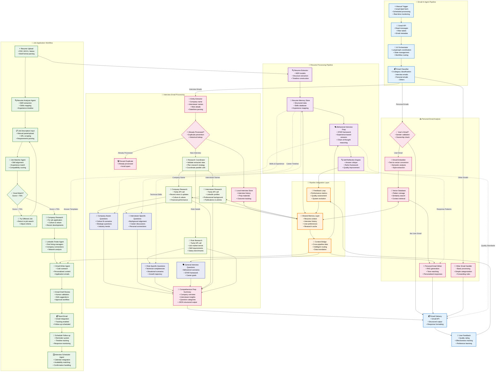

```mermaid
flowchart TB
    %% Job Application Workflow
    subgraph JobAppFlow["🎯 Job Application Workflow"]
        direction TB
        ResumeUpload["⭐ Resume Upload<br>• PDF, DOCX, Notion<br>• Multi-format parsing"]
        ResumeAnalyzerAgent["🔍 Resume Analyzer Agent<br>• NER extraction<br>• Skills mapping<br>• Experience timeline"]
        JobDescInput["📋 Job Description Input<br>• Manual paste/upload<br>• URL scraping<br>• Requirements parsing"]
        JobMatcherAgent["🎯 Job Matcher Agent<br>• Skill alignment<br>• Experience match<br>• Compatibility scoring"]
        MatchDecision{"✅ Good Match?<br>Score > 75%"}
        TryDifferentJob["🔄 Try Different Job<br>• Return to job search<br>• Adjust criteria"]
        CompanyResearchJob["🏢 Company Research<br>• For job application<br>• Culture & values<br>• Recent developments"]
        LinkedInFinderAgent["🔗 LinkedIn Finder Agent<br>• Find hiring managers<br>• Company connections<br>• Network analysis"]
        EmailWriterAgent["📧 Email Writer Agent<br>• Cold outreach<br>• Personalized content<br>• Application emails"]
        EmailDraftReview["📝 Email Draft Review<br>• Human validation<br>• Edit suggestions<br>• Approval workflow"]
        SendEmail["📬 Send Email<br>• Gmail integration<br>• Tracking enabled<br>• Follow-up scheduled"]
        ScheduleFollowup["📅 Schedule Follow-up<br>• Reminder system<br>• Timeline tracking<br>• Response monitoring"]
        InterviewSchedulerAgent["🗓️ Interview Scheduler Agent<br>• Calendar integration<br>• Availability matching<br>• Confirmation handling"]
    end

    %% Email Processing System
    subgraph EmailSystem["📧 Email AI Agent Pipeline"]
        direction TB
        UserTrigger["⭐ Manual Trigger<br>• Gmail label fetch<br>• Scheduled processing<br>• Real-time monitoring"]
        GmailAPI["📡 Gmail API<br>• Read messages<br>• Filter labels<br>• Email metadata"]
        Orchestrator["🧠 AI Orchestrator<br>• LangGraph coordination<br>• State management<br>• Workflow routing"]
        EmailClassifier["📬 Email Classifier<br>• 3-category classification:<br>  - Interview emails<br>  - Personal emails<br>  - Others"]
    end

    %% Interview Email Processing
    subgraph InterviewFlow["🎯 Interview Email Processing"]
        direction TB
        EntityExtractor["🎯 Entity Extractor<br>• Company name<br>• Interviewer names<br>• Role details<br>• Date/time parsing"]
        InterviewCheck{"🤔 Already Processed?<br>• Duplicate prevention<br>• Historical lookup"}
        LocalStore["📂 Local Interview Store<br>• Interview history<br>• Prep materials<br>• Outcome tracking"]
        DiscardDuplicate["🗑️ Discard Duplicate<br>• Already processed<br>• Avoid spam"]
        
        %% New Research Coordination Node
        ResearchCoordinator["🔬 Research Coordinator<br>• Validate extracted data<br>• Plan research strategy<br>• Coordinate parallel calls"]
        
        %% Parallel Research Calls
        CompanyResearch["🏢 Company Research<br>• Tavily API call<br>• Recent news & updates<br>• Culture & values<br>• Financial performance"]
        InterviewerResearch["👤 Interviewer Research<br>• Tavily API call<br>• LinkedIn profiles<br>• Professional background<br>• Publications & articles"]
        RoleResearch["🎯 Role Research<br>• Tavily API call<br>• Job market trends<br>• Skill requirements<br>• Salary benchmarks"]
        
        %% Question Generation
        CompanyQuestions["🏢 Company-Aware Questions<br>• Culture fit scenarios<br>• Strategic questions<br>• Industry trends"]
        InterviewerQuestions["👤 Interviewer-Specific Questions<br>• Background alignment<br>• Career discussions<br>• Personal connections"]
        RoleQuestions["🎯 Role-Specific Questions<br>• Technical competencies<br>• Situational scenarios<br>• Growth trajectory"]
        GeneralQuestions["🗣️ General Interview Questions<br>• Behavioral scenarios<br>• STAR framework<br>• Career goals"]
        
        PrepSummary["📝 Comprehensive Prep Summary<br>• Company overview<br>• Interviewer insights<br>• Question categories<br>• JSON structured output"]
    end

    %% Personal Email Processing
    subgraph PersonalFlow["📥 Personal Email Analysis"]
        direction TB
        UserCheck{"✅ User's Email?<br>• Sender validation<br>• Ownership check"}
        EmailEmbedder["🔎 Email Embedder<br>• Text-to-vector conversion<br>• Semantic analysis<br>• Style extraction"]
        VectorStore["🧠 Vector Database<br>• Pattern storage<br>• Similarity search<br>• Context retrieval"]
        PersonalEmailWriter["📧 Personal Email Writer<br>• RAG generation<br>• Tone matching<br>• Personalized responses"]
        OtherEmailHandler["📎 Other Email Handler<br>• Basic processing<br>• Simple categorization<br>• Forwarding rules"]
    end

    %% Resume Processing Pipeline
    subgraph ResumeSystem["📄 Resume Processing Pipeline"]
        direction TB
        ResumeExtractor["🔍 Resume Extractor<br>• NER models<br>• Structure extraction<br>• Timeline construction"]
        ResumeMemory["🧠 Resume Memory Store<br>• Structured data<br>• Skills database<br>• Experience mapping"]
        BehavioralPrep["🎭 Behavioral Interview Prep<br>• STAR framework<br>• Experience-based answers<br>• Chain-of-thought reasoning"]
        SelfReflection["🔍 Self-Reflection Engine<br>• Answer critique<br>• ReAct framework<br>• Quality improvement"]
    end

    %% Integration Layer
    subgraph Integration["🔗 Pipeline Integration Layer"]
        direction LR
        SharedMemory["🧠 Shared Memory Layer<br>• Resume context<br>• Interview history<br>• User preferences<br>• Research cache"]
        ContextBridge["🌉 Context Bridge<br>• Cross-pipeline data<br>• Intelligent routing<br>• Data translation"]
        FeedbackLoop["🔄 Feedback Loop<br>• Performance metrics<br>• Quality assessment<br>• System evolution"]
    end

    %% Output and Delivery
    EmailSender["📬 Email Delivery<br>• Gmail API<br>• Structured output<br>• Response formatting"]
    UserFeedback["👤 User Feedback<br>• Quality rating<br>• Effectiveness tracking<br>• Preference learning"]

    %% Job Application Workflow Connections
    ResumeUpload --> ResumeAnalyzerAgent
    ResumeAnalyzerAgent --> JobDescInput
    JobDescInput --> JobMatcherAgent
    JobMatcherAgent --> MatchDecision
    MatchDecision -->|"Score < 75%"| TryDifferentJob
    MatchDecision -->|"Score ≥ 75%"| CompanyResearchJob
    CompanyResearchJob --> LinkedInFinderAgent
    LinkedInFinderAgent --> EmailWriterAgent
    EmailWriterAgent --> EmailDraftReview
    EmailDraftReview --> SendEmail
    SendEmail --> ScheduleFollowup
    ScheduleFollowup --> InterviewSchedulerAgent
    TryDifferentJob --> JobDescInput

    %% Email System Connections
    UserTrigger --> GmailAPI
    GmailAPI --> Orchestrator
    Orchestrator --> EmailClassifier

    %% Email Classification Routing
    EmailClassifier -->|"Interview Emails"| EntityExtractor
    EmailClassifier -->|"Personal Emails"| UserCheck
    EmailClassifier -->|"Other Emails"| OtherEmailHandler

    %% Interview Processing Flow
    EntityExtractor --> InterviewCheck
    InterviewCheck -->|"New Interview"| ResearchCoordinator
    InterviewCheck -->|"Already Processed"| DiscardDuplicate
    InterviewCheck --> LocalStore

    %% Research Coordination (NEW - Single point before splitting)
    ResearchCoordinator -->|"Company Name"| CompanyResearch
    ResearchCoordinator -->|"Interviewer Names"| InterviewerResearch
    ResearchCoordinator -->|"Role Details"| RoleResearch

    %% Research to Questions
    CompanyResearch --> CompanyQuestions
    InterviewerResearch --> InterviewerQuestions
    RoleResearch --> RoleQuestions

    %% Question Aggregation
    CompanyQuestions --> PrepSummary
    InterviewerQuestions --> PrepSummary
    RoleQuestions --> PrepSummary
    GeneralQuestions --> PrepSummary

    %% Research Data to Summary
    CompanyResearch --> PrepSummary
    InterviewerResearch --> PrepSummary
    RoleResearch --> PrepSummary

    PrepSummary --> EmailSender

    %% Personal Email Flow
    UserCheck -->|"User Email"| EmailEmbedder
    UserCheck -->|"Not User Email"| EmailSender
    EmailEmbedder --> VectorStore
    VectorStore --> PersonalEmailWriter
    PersonalEmailWriter --> EmailSender

    %% Other Email Flow
    OtherEmailHandler --> EmailSender

    %% Resume Processing Connections
    ResumeUpload --> ResumeExtractor
    ResumeExtractor --> ResumeMemory
    ResumeMemory --> BehavioralPrep
    BehavioralPrep --> SelfReflection

    %% Integration Layer Connections
    ResumeMemory <--> SharedMemory
    LocalStore <--> SharedMemory
    VectorStore <--> SharedMemory
    CompanyResearch <--> SharedMemory
    InterviewerResearch <--> SharedMemory

    SharedMemory --> ContextBridge
    ContextBridge --> BehavioralPrep
    ContextBridge --> GeneralQuestions
    ContextBridge --> EmailWriterAgent
    ContextBridge --> PersonalEmailWriter

    %% Feedback Connections
    EmailSender --> UserFeedback
    SelfReflection --> FeedbackLoop
    UserFeedback --> FeedbackLoop
    FeedbackLoop --> SharedMemory

    %% Cross-Pipeline Intelligence (Dotted Lines)
    ResumeMemory -.->|"Skills & Experience"| CompanyQuestions
    ResumeMemory -.->|"Career Timeline"| InterviewerQuestions
    ResumeMemory -.->|"Technical Skills"| RoleQuestions
    BehavioralPrep -.->|"Answer Templates"| EmailWriterAgent
    BehavioralPrep -.->|"Response Patterns"| PersonalEmailWriter
    SelfReflection -.->|"Quality Standards"| EmailSender

    %% Styling
    classDef jobAppStyle fill:#e8f5e8,stroke:#2e7d32,stroke-width:2px,color:#000000
    classDef emailStyle fill:#e3f2fd,stroke:#1976d2,stroke-width:2px,color:#000000
    classDef researchStyle fill:#f1f8e9,stroke:#558b2f,stroke-width:2px,color:#000000
    classDef questionStyle fill:#e8eaf6,stroke:#3f51b5,stroke-width:2px,color:#000000
    classDef flowStyle fill:#fce4ec,stroke:#c2185b,stroke-width:2px,color:#000000
    classDef integrationStyle fill:#fff3e0,stroke:#f57c00,stroke-width:3px,color:#000000
    classDef resumeStyle fill:#f3e5f5,stroke:#7b1fa2,stroke-width:2px,color:#000000

    %% Apply Styles
    ResumeUpload:::jobAppStyle
    ResumeAnalyzerAgent:::jobAppStyle
    JobDescInput:::jobAppStyle
    JobMatcherAgent:::jobAppStyle
    MatchDecision:::jobAppStyle
    TryDifferentJob:::jobAppStyle
    CompanyResearchJob:::jobAppStyle
    LinkedInFinderAgent:::jobAppStyle
    EmailWriterAgent:::jobAppStyle
    EmailDraftReview:::jobAppStyle
    SendEmail:::jobAppStyle
    ScheduleFollowup:::jobAppStyle
    InterviewSchedulerAgent:::jobAppStyle

    UserTrigger:::emailStyle
    GmailAPI:::emailStyle
    Orchestrator:::emailStyle
    EmailClassifier:::emailStyle
    EmailSender:::emailStyle
    UserFeedback:::emailStyle

    CompanyResearch:::researchStyle
    InterviewerResearch:::researchStyle
    RoleResearch:::researchStyle
    ResearchCoordinator:::researchStyle

    CompanyQuestions:::questionStyle
    InterviewerQuestions:::questionStyle
    RoleQuestions:::questionStyle
    GeneralQuestions:::questionStyle

    EntityExtractor:::flowStyle
    InterviewCheck:::flowStyle
    LocalStore:::flowStyle
    PrepSummary:::flowStyle
    UserCheck:::flowStyle
    EmailEmbedder:::flowStyle
    VectorStore:::flowStyle
    PersonalEmailWriter:::flowStyle
    OtherEmailHandler:::flowStyle
    DiscardDuplicate:::flowStyle

    SharedMemory:::integrationStyle
    ContextBridge:::integrationStyle
    FeedbackLoop:::integrationStyle

    ResumeExtractor:::resumeStyle
    ResumeMemory:::resumeStyle
    BehavioralPrep:::resumeStyle
    SelfReflection:::resumeStyle
```