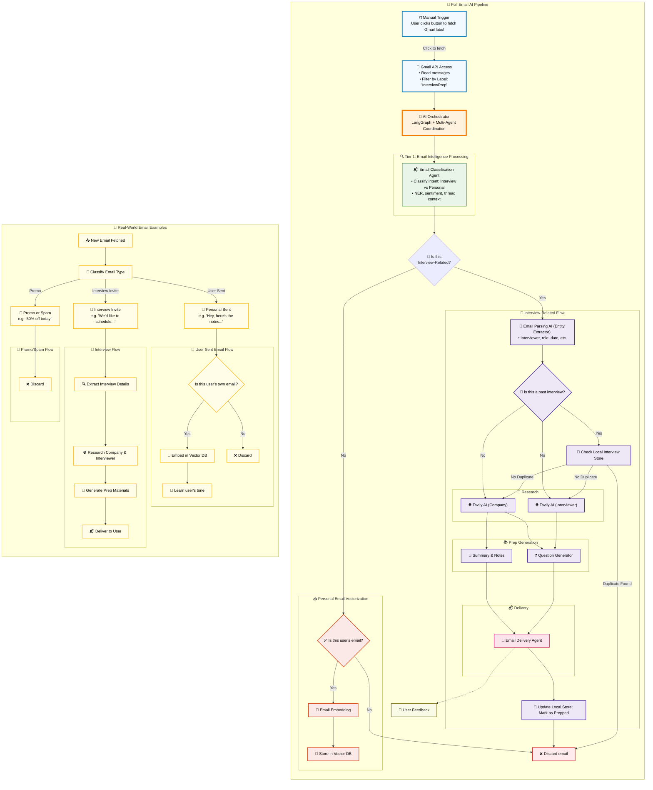

```mermaid
flowchart BT
 subgraph Tier1["🔍 Tier 1: Email Intelligence Processing"]
        EmailClassifier["📬 Email Classification Agent<br>• Classify intent: Interview vs Personal<br>• NER, sentiment, thread context"]
  end
 subgraph Tier2_Interview["🔬 Research"]
        TavilyInterviewer["🌐 Tavily AI (Interviewer)"]
        TavilyCompany["🌐 Tavily AI (Company)"]
  end
 subgraph Tier3_Interview["📚 Prep Generation"]
        AIQuestionGenerator["❓ Question Generator"]
        PreparationSummary["📝 Summary & Notes"]
  end
 subgraph Tier4_Delivery["📬 Delivery"]
        EmailSender["📧 Email Delivery Agent"]
  end
 subgraph InterviewFlow["🧭 Interview-Related Flow"]
        EntityExtractor["🎯 Email Parsing AI (Entity Extractor) <br>• Interviewer, role, date, etc."]
        CheckPastInterviews{"🤔 is this a past interview?"}
        InterviewLocalStoreLookup["📂 Check Local Interview Store"]
        UpdateLocalStore["📂 Update Local Store: Mark as Prepped"]
        Tier2_Interview
        Tier3_Interview
        Tier4_Delivery
  end
 subgraph PersonalFlow["📥 Personal Email Vectorization"]
        UserEmailCheck@{ label: "✅ Is this user's email?" }
        EmailEmbedder["🔎 Email Embedding"]
        VectorStore["🧠 Store in Vector DB"]
  end
 subgraph A["📡 Full Email AI Pipeline"]
    direction TB
        UserButton["🖱️ Manual Trigger<br>User clicks button to fetch Gmail label"]
        GmailAPI@{ label: "📡 Gmail API Access<br>• Read messages<br>• Filter by Label: 'InterviewPrep'" }
        Orchestrator["🧠 AI Orchestrator<br>LangGraph + Multi-Agent Coordination"]
        Tier1
        Decision{"🤔 Is this<br>Interview-Related?"}
        InterviewFlow
        PersonalFlow
        End["❌ Discard email"]
        UserFeedback["👤 User Feedback"]
  end
 subgraph InterviewExample["🎯 Interview Flow"]
        Extractor["🔍 Extract Interview Details"]
        Research["🌐 Research Company & Interviewer"]
        Prep["📝 Generate Prep Materials"]
        Deliver["📬 Deliver to User"]
  end
 subgraph PersonalExample["🧠 User Sent Email Flow"]
        OwnershipCheck@{ label: "Is this user's own email?" }
        Embedder["🔎 Embed in Vector DB"]
        LearnPersonal@{ label: "🧠 Learn user's tone" }
        Trash1["❌ Discard"]
  end
 subgraph DiscardExample["🚫 Promo/Spam Flow"]
        Trash2["❌ Discard"]
  end
 subgraph B["📩 Real-World Email Examples"]
    direction TB
        Start["📥 New Email Fetched"]
        Classifier["🧠 Classify Email Type"]
        InterviewEmail@{ label: "🎯 Interview Invite<br>e.g. 'We’d like to schedule...'" }
        PersonalEmail@{ label: "📨 Personal Sent<br>e.g. 'Hey, here's the notes...'" }
        DiscardEmail@{ label: "📢 Promo or Spam<br>e.g. '50% off today!'" }
        InterviewExample
        PersonalExample
        DiscardExample
  end

    UserButton -- Click to fetch --> GmailAPI
    GmailAPI --> Orchestrator
    Orchestrator --> EmailClassifier
    EmailClassifier --> Decision
    Decision -- Yes --> EntityExtractor
    EntityExtractor --> CheckPastInterviews
    CheckPastInterviews -- Yes --> InterviewLocalStoreLookup
    InterviewLocalStoreLookup -- Duplicate Found --> End
    InterviewLocalStoreLookup -- No Duplicate --> TavilyInterviewer & TavilyCompany
    CheckPastInterviews -- No --> TavilyInterviewer & TavilyCompany
    TavilyInterviewer --> AIQuestionGenerator
    TavilyCompany --> AIQuestionGenerator & PreparationSummary
    AIQuestionGenerator --> EmailSender
    PreparationSummary --> EmailSender
    EmailSender -.-> UserFeedback
    EmailSender --> UpdateLocalStore
    UpdateLocalStore --> End
    Decision -- No --> UserEmailCheck
    UserEmailCheck -- Yes --> EmailEmbedder
    EmailEmbedder --> VectorStore
    UserEmailCheck -- No --> End
    Start --> Classifier
    Classifier -- Interview Invite --> InterviewEmail
    InterviewEmail --> Extractor
    Extractor --> Research
    Research --> Prep
    Prep --> Deliver
    Classifier -- User Sent --> PersonalEmail
    PersonalEmail --> OwnershipCheck
    OwnershipCheck -- Yes --> Embedder
    Embedder --> LearnPersonal
    OwnershipCheck -- No --> Trash1
    Classifier -- Promo --> DiscardEmail
    DiscardEmail --> Trash2

    UserEmailCheck@{ shape: diamond}
    GmailAPI@{ shape: rect}
    OwnershipCheck@{ shape: diamond}
    LearnPersonal@{ shape: rect}
    InterviewEmail@{ shape: rect}
    PersonalEmail@{ shape: rect}
    DiscardEmail@{ shape: rect}
     EmailClassifier:::tier1Style
     TavilyInterviewer:::interviewStyle
     TavilyCompany:::interviewStyle
     AIQuestionGenerator:::interviewStyle
     PreparationSummary:::interviewStyle
     EmailSender:::deliveryStyle
     EntityExtractor:::interviewStyle
     CheckPastInterviews:::interviewStyle
     InterviewLocalStoreLookup:::interviewStyle
     UpdateLocalStore:::interviewStyle
     UserEmailCheck:::personalStyle
     EmailEmbedder:::personalStyle
     VectorStore:::personalStyle
     UserButton:::triggerStyle
     GmailAPI:::triggerStyle
     Orchestrator:::orchestratorStyle
     End:::discardStyle
     UserFeedback:::feedbackStyle
     Extractor:::exampleStyle
     Research:::exampleStyle
     Prep:::exampleStyle
     Deliver:::exampleStyle
     OwnershipCheck:::exampleStyle
     Embedder:::exampleStyle
     LearnPersonal:::exampleStyle
     Trash1:::exampleStyle
     Trash2:::exampleStyle
     Start:::exampleStyle
     Classifier:::exampleStyle
     InterviewEmail:::exampleStyle
     PersonalEmail:::exampleStyle
     DiscardEmail:::exampleStyle

    classDef triggerStyle fill:#f3faff,stroke:#0277bd,stroke-width:3px,color:#000000
    classDef orchestratorStyle fill:#fff3e0,stroke:#f57c00,stroke-width:4px,color:#000000
    classDef tier1Style fill:#e8f5e8,stroke:#2e7d32,stroke-width:2px,color:#000000
    classDef interviewStyle fill:#ede7f6,stroke:#512da8,stroke-width:2px,color:#000000
    classDef personalStyle fill:#fbe9e7,stroke:#d84315,stroke-width:2px,color:#000000
    classDef deliveryStyle fill:#fce4ec,stroke:#c2185b,stroke-width:2px,color:#000000
    classDef feedbackStyle fill:#f9fbe7,stroke:#827717,stroke-width:2px,color:#000000
    classDef discardStyle fill:#ffebee,stroke:#d32f2f,stroke-width:2px,color:#000000
    classDef exampleStyle fill:#fffde7,stroke:#fbc02d,stroke-width:2px,color:#000000
```