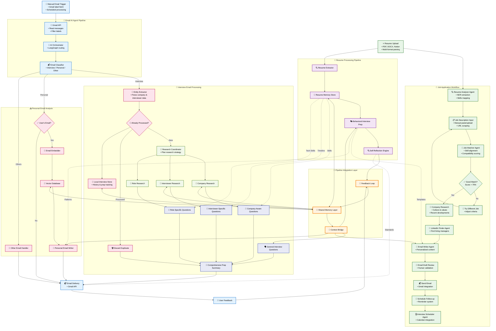

```mermaid

flowchart TD
    %% Entry Points at Top
    ResumeUploadTop["⭐ Resume Upload<br>• PDF, DOCX, Notion<br>• Multi-format parsing"]
    EmailTriggerTop["📧 Manual Email Trigger<br>• Gmail label fetch<br>• Scheduled processing"]

    %% Job Application Workflow
    subgraph JobAppFlow["🎯 Job Application Workflow"]
        direction TB
        ResumeAnalyzerAgent["🔍 Resume Analyzer Agent<br>• NER extraction<br>• Skills mapping"]
        JobDescInput["📋 Job Description Input<br>• Manual paste/upload<br>• URL scraping"]
        JobMatcherAgent["🎯 Job Matcher Agent<br>• Skill alignment<br>• Compatibility scoring"]
        MatchDecision{"✅ Good Match?<br>Score > 75%"}
        TryDifferentJob["🔄 Try Different Job<br>• Adjust criteria"]
        CompanyResearchJob["🏢 Company Research<br>• Culture & values<br>• Recent developments"]
        LinkedInFinderAgent["🔗 LinkedIn Finder Agent<br>• Find hiring managers"]
        EmailWriterAgent["📧 Email Writer Agent<br>• Personalized content"]
        EmailDraftReview["📝 Email Draft Review<br>• Human validation"]
        SendEmail["📬 Send Email<br>• Gmail integration"]
        ScheduleFollowup["📅 Schedule Follow-up<br>• Reminder system"]
        InterviewSchedulerAgent["🗓️ Interview Scheduler Agent<br>• Calendar integration"]
    end

    %% Email Processing System
    subgraph EmailSystem["📧 Email AI Agent Pipeline"]
        direction TB
        UserTrigger["📡 Gmail API<br>• Read messages<br>• Filter labels"]
        Orchestrator["🧠 AI Orchestrator<br>• LangGraph routing"]
        EmailClassifier["📬 Email Classifier<br>• Interview / Personal / Other"]
    end

    %% Interview Email Processing
    subgraph InterviewFlow["🎯 Interview Email Processing"]
        direction TB
        EntityExtractor["🎯 Entity Extractor<br>• Parse company & interviewer data"]
        InterviewCheck{"🤔 Already Processed?"}
        DiscardDuplicate["🗑️ Discard Duplicate"]
        LocalStore["📂 Local Interview Store<br>• History & prep tracking"]

        ResearchCoordinator["🔬 Research Coordinator<br>• Plan research strategy"]
        CompanyResearch["🏢 Company Research"]
        InterviewerResearch["👤 Interviewer Research"]
        RoleResearch["🎯 Role Research"]

        CompanyQuestions["🏢 Company-Aware Questions"]
        InterviewerQuestions["👤 Interviewer-Specific Questions"]
        RoleQuestions["🎯 Role-Specific Questions"]
        GeneralQuestions["🗣️ General Interview Questions"]

        PrepSummary["📝 Comprehensive Prep Summary"]
    end

    %% Personal Email Processing
    subgraph PersonalFlow["📥 Personal Email Analysis"]
        direction TB
        UserCheck{"✅ User's Email?"}
        EmailEmbedder["🔎 Email Embedder"]
        VectorStore["🧠 Vector Database"]
        PersonalEmailWriter["📧 Personal Email Writer"]
        OtherEmailHandler["📎 Other Email Handler"]
    end

    %% Resume Processing Pipeline
    subgraph ResumeSystem["📄 Resume Processing Pipeline"]
        direction TB
        ResumeExtractor["🔍 Resume Extractor"]
        ResumeMemory["🧠 Resume Memory Store"]
        BehavioralPrep["🎭 Behavioral Interview Prep"]
        SelfReflection["🔍 Self-Reflection Engine"]
    end

    %% Integration Layer
    subgraph Integration["🔗 Pipeline Integration Layer"]
        direction LR
        SharedMemory["🧠 Shared Memory Layer"]
        ContextBridge["🌉 Context Bridge"]
        FeedbackLoop["🔄 Feedback Loop"]
    end

    %% Output
    EmailSender["📬 Email Delivery<br>• Gmail API"]
    UserFeedback["👤 User Feedback"]

    %% Entry Point Connections
    ResumeUploadTop --> ResumeAnalyzerAgent
    EmailTriggerTop --> UserTrigger

    %% Job Application Flow Connections
    ResumeAnalyzerAgent --> JobDescInput
    JobDescInput --> JobMatcherAgent
    JobMatcherAgent --> MatchDecision
    MatchDecision -->|"No"| TryDifferentJob
    MatchDecision -->|"Yes"| CompanyResearchJob
    TryDifferentJob --> JobDescInput
    CompanyResearchJob --> LinkedInFinderAgent
    LinkedInFinderAgent --> EmailWriterAgent
    EmailWriterAgent --> EmailDraftReview
    EmailDraftReview --> SendEmail
    SendEmail --> ScheduleFollowup
    ScheduleFollowup --> InterviewSchedulerAgent

    %% Email Pipeline Flow
    UserTrigger --> Orchestrator
    Orchestrator --> EmailClassifier
    EmailClassifier -->|"Interview"| EntityExtractor
    EmailClassifier -->|"Personal"| UserCheck
    EmailClassifier -->|"Others"| OtherEmailHandler

    EntityExtractor --> InterviewCheck
    InterviewCheck -->|"New"| ResearchCoordinator
    InterviewCheck -->|"Processed"| DiscardDuplicate
    InterviewCheck --> LocalStore
    DiscardDuplicate --> PrepSummary

    ResearchCoordinator --> CompanyResearch
    ResearchCoordinator --> InterviewerResearch
    ResearchCoordinator --> RoleResearch

    CompanyResearch --> CompanyQuestions
    InterviewerResearch --> InterviewerQuestions
    RoleResearch --> RoleQuestions

    CompanyQuestions --> PrepSummary
    InterviewerQuestions --> PrepSummary
    RoleQuestions --> PrepSummary
    GeneralQuestions --> PrepSummary

    PrepSummary --> EmailSender

    %% Personal Email Path
    UserCheck -->|"Yes"| EmailEmbedder
    UserCheck -->|"No"| EmailSender
    EmailEmbedder --> VectorStore
    VectorStore --> PersonalEmailWriter
    PersonalEmailWriter --> EmailSender

    OtherEmailHandler --> EmailSender

    %% Resume Pipeline Flow
    ResumeUploadTop --> ResumeExtractor
    ResumeExtractor --> ResumeMemory
    ResumeMemory --> BehavioralPrep
    BehavioralPrep --> SelfReflection

    %% Integrations
    ResumeMemory <--> SharedMemory
    LocalStore <--> SharedMemory
    VectorStore <--> SharedMemory
    CompanyResearch <--> SharedMemory
    InterviewerResearch <--> SharedMemory
    SharedMemory --> ContextBridge
    ContextBridge --> BehavioralPrep
    ContextBridge --> GeneralQuestions
    ContextBridge --> EmailWriterAgent
    ContextBridge --> PersonalEmailWriter

    EmailSender --> UserFeedback
    SelfReflection --> FeedbackLoop
    UserFeedback --> FeedbackLoop
    FeedbackLoop --> SharedMemory

    %% Cross-links (Dotted Style for Contextual Use Only)
    ResumeMemory -.->|"Skills"| CompanyQuestions
    ResumeMemory -.->|"Timeline"| InterviewerQuestions
    ResumeMemory -.->|"Tech Skills"| RoleQuestions
    BehavioralPrep -.->|"Templates"| EmailWriterAgent
    BehavioralPrep -.->|"Patterns"| PersonalEmailWriter
    SelfReflection -.->|"Standards"| EmailSender

    %% Styling Classes
    classDef jobAppStyle fill:#e8f5e8,stroke:#2e7d32,stroke-width:2px,color:#000000;
    classDef emailStyle fill:#e3f2fd,stroke:#1976d2,stroke-width:2px,color:#000000;
    classDef researchStyle fill:#f1f8e9,stroke:#558b2f,stroke-width:2px,color:#000000;
    classDef questionStyle fill:#e8eaf6,stroke:#3f51b5,stroke-width:2px,color:#000000;
    classDef flowStyle fill:#fce4ec,stroke:#c2185b,stroke-width:2px,color:#000000;
    classDef integrationStyle fill:#fff3e0,stroke:#f57c00,stroke-width:3px,color:#000000;
    classDef resumeStyle fill:#f3e5f5,stroke:#7b1fa2,stroke-width:2px,color:#000000;

    class ResumeUploadTop,ResumeAnalyzerAgent,JobDescInput,JobMatcherAgent,MatchDecision,TryDifferentJob,CompanyResearchJob,LinkedInFinderAgent,EmailWriterAgent,EmailDraftReview,SendEmail,ScheduleFollowup,InterviewSchedulerAgent jobAppStyle

    class EmailTriggerTop,UserTrigger,Orchestrator,EmailClassifier,EmailSender,UserFeedback emailStyle

    class CompanyResearch,InterviewerResearch,RoleResearch,ResearchCoordinator researchStyle

    class CompanyQuestions,InterviewerQuestions,RoleQuestions,GeneralQuestions,PrepSummary questionStyle

    class EntityExtractor,InterviewCheck,LocalStore,UserCheck,EmailEmbedder,VectorStore,PersonalEmailWriter,OtherEmailHandler,DiscardDuplicate flowStyle

    class SharedMemory,ContextBridge,FeedbackLoop integrationStyle

    class ResumeExtractor,ResumeMemory,BehavioralPrep,SelfReflection resumeStyle

```